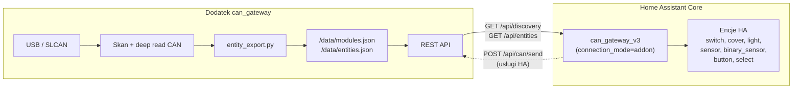

# CAN Gateway — Home Assistant (add-on + integracja)


Jedno repozytorium dla całego stacku Home Assistant CAN Gateway:


| Ścieżka | Opis |

|---------|------|

| `can_gateway/` | Dodatek Supervisor **5.0.40** (SLCAN, panel skanu, REST :8099, katalog encji) |

| `can_gateway/integration/can_gateway_v3/` | Integracja bundlowana w dodatku (auto-deploy przy starcie) |

| `custom_components/can_gateway_v3/` | Ta sama integracja w korzeniu repo — źródło, z którego dodatek kopiuje pliki |

| `repository.yaml` | Manifest sklepu dodatków Supervisor |


Firmware, konfigurator Windows i dokumentacja protokołu CAN: [can-control-suite](https://github.com/arturkmat/can-control-suite).


## Architektura (add-on + integracja)





| Rola | Dodatek | Integracja (add-on mode) |

|------|---------|---------------------------|

| Dostęp do USB/CAN | **Tak** | **Nie** |

| Skan magistrali | **Tak** | **Nie** |

| Katalog encji | **Tak** (`/data/entities.json`) | Czyta z API |

| Tworzenie encji HA | **Nie** | **Tak** (wyłącznie z katalogu) |

| Live state (relay, cover…) | Zapisuje w katalogu + `/api/entities` | Poll co 5 s |


## Instalacja (Home Assistant OS / Supervised) — zalecane


1. **Ustawienia → Dodatki → Sklep dodatków → ⋮ → Repozytoria**

2. Dodaj URL: `https://github.com/arturkmat/ha-can-gateway`

3. Odśwież sklep dodatków, zainstaluj **CAN Gateway**, w sekcji **connectivity** ustaw `can_port` i `can_bitrate` (**125000**), uruchom dodatek.

4. **Gotowe** — dodatek kopiuje `can_gateway_v3` do `/config/custom_components/`, przeładowuje custom components i wysyła discovery Supervisor; HA tworzy wpis integracji automatycznie (`connection_mode=addon`).

## Raspberry Pi 5 + CAN-HUB-STM32 (UART SLCAN)

Topologia docelowa: **Home Assistant OS na RPi 5** → **UART 3,3 V (SLCAN)** → **hub STM32G474 (CAN-HUB-STM32, rola master)** → magistrala CAN **125 kbit/s** (moduły ESP). USB-CAN nie jest potrzebny; hub przepisuje ramki CAN i wystawia ten sam dialekt SLCAN co adapter WeAct.

Opis sprzętu i pinów: `CAN-HUB-STM32/FIRMWARE_PLAN.md` (w monorepo [can-control-suite](https://github.com/arturkmat/can-control-suite) lub lokalnie obok tego repo).

### Docelowe opcje dodatku (Supervisor → CAN Gateway → Konfiguracja)

| Pole | Wartość | Uwagi |
|------|---------|--------|
| `connectivity.can_interface` | `slcan` | jedyny tryb w dodatku |
| `connectivity.can_port` | `/dev/ttyAMA0` | albo ścieżka, na którą wskazuje `/dev/serial0` — **ta sama** w opcji i w logu startu dodatku |
| `connectivity.can_bitrate` | `125000` | prędkość **magistrali CAN** (hub i moduły); dodatek przekazuje ją do python-can przy otwarciu SLCAN |
| `connectivity.tty_baudrate` | **`460800`** | prędkość **łącza UART** Pi ↔ hub; firmware huba: UART4 **460800 8N1**, bez flow control |

Przykład JSON opcji (edycja YAML w UI robi to samo):

```yaml
connectivity:
  can_interface: slcan
  can_port: /dev/ttyAMA0
  can_bitrate: 125000
  tty_baudrate: 460800
```

Dodatek ma `uart: true` i listę `devices` w `can_gateway/config.yaml` (w tym `/dev/ttyAMA0`, `/dev/serial0`) — Supervisor mapuje te węzły do kontenera. Po zmianie listy urządzeń zrestartuj dodatek.

### Okablowanie (3,3 V, wspólna masa)

| Raspberry Pi 5 | CAN-HUB-STM32 (master, UART4) |
|----------------|-------------------------------|
| GPIO14 / TX (pin 8) | PC11 / RX |
| GPIO15 / RX (pin 10) | PC10 / TX |
| GND (np. pin 6) | GND |

Hub → magistrala: CAN_H / CAN_L przez transceiver **TJA1051**, **125 kbit/s**, terminacja **120 Ω** na końcach pnia (zgodnie z okablowaniem instalacji). Logika UART i CAN transceivera: **3,3 V** — nie podłączaj 5 V na linie UART Pi.

Rola płytki hub musi być **master** (zworki PA5/PA9/PA10 wg `FIRMWARE_PLAN.md`). SLCAN na UART jest aktywny tylko na masterze; slave’y rozdzielnicy nie zastępują tego portu.

### Raspberry Pi 5 — UART w systemie

1. **Jeden konsument UART** — portu nie może równolegle używać konsola serial, plugin ani drugi dodatek.
2. **Właściwe `/dev/tty*`** — na hoście (SSH do HA: *Advanced → Terminal* albo add-on Terminal):
   - `ls -l /dev/serial0` → docelowa ścieżka (często `ttyAMA0` po wyłączeniu Bluetooth na UART0).
   - `ls /dev/ttyAMA* /dev/ttyS*`
3. **Bluetooth a ttyAMA0** — jeśli `/dev/serial0` wskazuje na `ttyS0` (mini UART), a potrzebujesz stabilnego UART0: w konfiguracji boardu (np. `config.txt` / overlay HA OS dla RPi) typowo **wyłączenie BT na UART0** (`disable-bt` / przeniesienie BT na mini UART — zależnie od obrazu). Po reboot sprawdź ponownie symlinki.
4. **Bez flow control** — nie łącz pinów RTS/CTS; hub i dodatek zakładają **8N1, brak HW flow control**.
5. **Baud UART ≠ CAN** — **460800** to UART do STM32; **125000** to bitrate CAN w opcjach dodatku. Ustawienie `tty_baudrate: 115200` (domyślne pod USB WeAct) **nie zadziała** z firmware huba (460800).
6. **Uprawnienia** — na HA OS urządzenia z `devices:` / `uart: true` trafiają do kontenera dodatku; jeśli start loguje „Urzadzenie … nie istnieje”, brakuje mapowania lub zła ścieżka w `can_port`.
7. **Magistrala bez Pi** — forwarding CAN w hubie działa bez Raspberry; brak HA nie blokuje włączników (UART tylko do konfiguracji/sterowania z dodatku).

### Oczekiwania SLCAN (hub vs USB adapter)

Dodatek otwiera magistralę przez **python-can** (`interface=slcan`), wysyła standardowe komendy otwarcia i bitrate CAN, ramki **`t`** / **`r`** (11-bit ID, hex). Hub STM32:

- odbiera linie **`t`/`r`** i wstrzykuje je do huba CAN jak ruch z portu HOST;
- nadaje odebrane ramki CAN na UART jako linie SLCAN z `\r`;
- obsługuje m.in. **`O`/`C`**, **`S4`**, **`V`**, **`N`**, **`F`** (potwierdzenia jak typowy adapter);
- **nie odsyła echem** własnej transmisji z HA.

Integracja HA **nie** otwiera portu szeregowego — tylko REST dodatku (`connection_mode=addon`).

### Checklist wdrożenia (RPi 5 + hub)

- [ ] Hub STM32 wgrany, rola **master**, pień CAN podłączony do instalacji **125 kbit/s**
- [ ] UART Pi ↔ hub (TX↔RX, GND), **460800 8N1**, bez RTS/CTS
- [ ] Na hoście: poprawny `/dev/ttyAMA0` lub `/dev/serial0` istnieje i jest wolny
- [ ] Dodatek: `can_port` = ta ścieżka, `tty_baudrate` = **460800**, `can_bitrate` = **125000**
- [ ] Log dodatku: `SLCAN open /dev/... @ 460800 (CAN 125000)`; brak ciągłych reconnect
- [ ] Panel Ingress → **Skanuj magistralę** → moduły w `/data/modules.json`
- [ ] Encje w HA po `discovery_version` ≥ 1


Panel: **Ustawienia → Dodatki → CAN Gateway → Otwórz panel web** — **Skanuj magistralę**, lista modułów z liczbą encji. Encje w HA pojawiają się automatycznie po zapisie katalogu (integracja nasłuchuje `discovery_version`).


### Workflow użytkownika


1. Uruchom dodatek CAN Gateway (adapter USB przypisany do kontenera dodatku).

2. Otwórz panel Ingress → **Skanuj magistralę** (deep read GPIO, relay, shutter, sensory).

3. Dodatek zapisuje `modules.json` + `entities.json` i inkrementuje `discovery_version`.

4. Integracja `can_gateway_v3` wykrywa zmianę wersji → przeładowuje platformy → tworzy/aktualizuje encje wyłącznie z katalogu.

5. Sterowanie w HA (przełączniki, rolety, LED) idzie przez usługi integracji → REST dodatku → magistrala CAN.


### Czyszczenie starych encji (po aktualizacji lub błędnej konfiguracji)


Jeśli encje CAN pojawiły się w HA **zanim** wykonałeś skan w panelu dodatku (lub po starszej wersji integracji):


1. **Ustawienia → Urządzenia i usługi → CAN Gateway** → menu (⋮) → **Usuń**.

2. Zrestartuj dodatek **CAN Gateway** (Ustawienia → Dodatki → CAN Gateway → Uruchom ponownie).

3. Otwórz panel Ingress dodatku → **Skanuj magistralę** — poczekaj na zapis katalogu (`discovery_version ≥ 1`, liczba encji > 0).

4. Integracja zostanie dodana ponownie automatycznie (Supervisor discovery) albo ręcznie: **Dodaj integrację → CAN Gateway**.

5. Encje w HA powinny odpowiadać wyłącznie katalogowi z `/data/entities.json`.


Sensor **Gateway Last Scan** w integracji pokazuje `waiting`, dopóki dodatek nie zapisze katalogu po skanie.


## Instalacja integracji bez auto-deploy (ręczna kopia)


Integracja **wymaga działającego dodatku** — łączy się z jego REST API (`GET /api/discovery`, `GET /api/entities`) i nie ma trybu pracy bez niego (dawny tryb "direct serial", w którym integracja sama otwierała port USB/CAN, został usunięty — dubel logiki skanu/CAN I/O z dodatkiem generował konflikty). Jeśli z jakiegoś powodu auto-deploy dodatku (`deploy_integration.sh`) nie zadziałał:


1. Skopiuj ręcznie `custom_components/can_gateway_v3/` z tego repo do `/config/custom_components/can_gateway_v3/` na Twojej instancji HA.

2. Zrestartuj HA.

3. **Dodaj integrację → CAN Gateway** — wymaga uruchomionego i osiągalnego dodatku CAN Gateway.


Integracja **nie jest** dystrybuowana przez HACS — jedyne wspierane źródło instalacji to dodatek Supervisor (auto-deploy) albo ręczna kopia plików powyżej. Instalacja przez HACS prowadziła do konfliktu wersji między kopią HACS a kopią wdrażaną przez dodatek (ten sam folder `/config/custom_components/can_gateway_v3/` nadpisywany przez dwa niezależne mechanizmy).


## API dodatku (skrót)


| Metoda | Endpoint | Opis |

|--------|----------|------|

| GET | `/api/health` | Health check |

| GET | `/api/discovery` | Moduły + katalog encji + `discovery_version` |

| GET | `/api/entities` | Pełny katalog encji (integracja HA) + live values |

| GET | `/api/modules` | Pełna lista modułów |

| POST | `/api/scan` | Skan magistrali + zapis katalogu; zwraca `entity_count` |

| GET | `/api/state` | Legacy snapshot (moduły + encje); preferuj `/api/entities` |

| POST | `/api/can/send` | TX CAN (usługi v3 w trybie add-on) |


### Kontrakt `GET /api/entities`


```json

{

  "ok": true,

  "discovery_version": 3,

  "entity_count": 12,

  "updated_at": 1750000000.0,

  "last_scan_at": 1750000000.0,

  "entities": [

    {

      "platform": "switch",

      "unique_id": "m201_local_relay1",

      "name": "CAN M201 Relay 1",

      "module_id": 201,

      "value": false,

      "attributes": { "module_id": 201, "relay_no": 1, "source": "local" }

    }

  ],

  "status": { "bus_ok": true, "version": "0.7.0" }

}

```


Pola encji: `platform`, `unique_id`, `name`, `module_id`, opcjonalnie `value`, `attributes`, `device_class`, `unit`, `icon`.


## Sync integracji (dla deweloperów)


Po edycji `custom_components/can_gateway_v3/`:


```powershell

powershell -ExecutionPolicy Bypass -File .\tools\sync_addon_integration.ps1

```


## Testy


```powershell

python -m pytest tests/ -q

```

