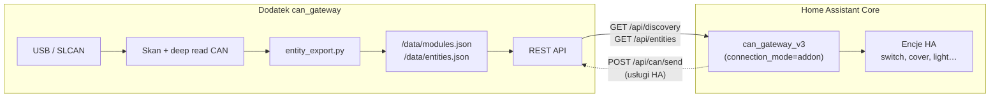

# CAN Gateway — Home Assistant (add-on + integracja)


Jedno repozytorium dla całego stacku Home Assistant CAN Gateway:


| Ścieżka | Opis |

|---------|------|

| `can_gateway/` | Dodatek Supervisor **v0.7.1** (USB-CAN, panel skanu, REST API, katalog encji) |

| `can_gateway/integration/can_gateway_v3/` | Integracja bundlowana w dodatku (auto-deploy przy starcie) |

| `custom_components/can_gateway_v3/` | Ta sama integracja w korzeniu — **HACS** i ręczna instalacja |

| `hacs.json` | Manifest HACS (integracja z tego repo) |

| `repository.yaml` | Manifest sklepu dodatków Supervisor |


Firmware, konfigurator Windows i dokumentacja protokołu CAN: [can-control-suite](https://github.com/arturkmat/can-control-suite).


## Architektura (add-on + integracja)





| Rola | Dodatek | Integracja (add-on mode) |

|------|---------|---------------------------|

| Dostęp do USB/CAN | **Tak** | **Nie** |

| Skan magistrali | **Tak** | **Nie** |

| Katalog encji | **Tak** (`/data/entities.json`) | Czyta z API |

| Tworzenie encji HA | **Nie** | **Tak** (wyłącznie z katalogu) |

| Live state (relay, cover…) | Zapisuje w katalogu + `/api/entities` | Poll co 5 s |


## Instalacja (Home Assistant OS / Supervised) — zalecane


1. **Ustawienia → Dodatki → Sklep dodatków → ⋮ → Repozytoria**

2. Dodaj URL: `https://github.com/arturkmat/ha-can-gateway`

3. Odśwież sklep dodatków, zainstaluj **CAN Gateway**, ustaw `can_port` i `can_bitrate` (**125000**), uruchom dodatek.

4. Dla firmware **V3** domyślnie `secure_can: false` (plain CAN). Opcja `secure_can: true` + klucz tylko dla legacy modułów ze szyfrowaniem.

5. **Gotowe** — dodatek kopiuje `can_gateway_v3` do `/config/custom_components/`, przeładowuje custom components i wysyła discovery Supervisor; HA tworzy wpis integracji automatycznie (`connection_mode=addon`).


Panel: **Ustawienia → Dodatki → CAN Gateway → Otwórz panel web** — **Skanuj magistralę**, lista modułów z liczbą encji. Encje w HA pojawiają się automatycznie po zapisie katalogu (integracja nasłuchuje `discovery_version`).


### Workflow użytkownika


1. Uruchom dodatek CAN Gateway (adapter USB przypisany do kontenera dodatku).

2. Otwórz panel Ingress → **Skanuj magistralę** (deep read GPIO, relay, shutter, sensory).

3. Dodatek zapisuje `modules.json` + `entities.json` i inkrementuje `discovery_version`.

4. Integracja `can_gateway_v3` wykrywa zmianę wersji → przeładowuje platformy → tworzy/aktualizuje encje wyłącznie z katalogu.

5. Sterowanie w HA (przełączniki, rolety, LED) idzie przez usługi integracji → REST dodatku → magistrala CAN.


### Czyszczenie starych encji (po aktualizacji lub błędnej konfiguracji)


Jeśli encje CAN pojawiły się w HA **zanim** wykonałeś skan w panelu dodatku (lub po starszej wersji integracji):


1. **Ustawienia → Urządzenia i usługi → CAN Gateway v3** → menu (⋮) → **Usuń**.

2. Zrestartuj dodatek **CAN Gateway** (Ustawienia → Dodatki → CAN Gateway → Uruchom ponownie).

3. Otwórz panel Ingress dodatku → **Skanuj magistralę** — poczekaj na zapis katalogu (`discovery_version ≥ 1`, liczba encji > 0).

4. Integracja zostanie dodana ponownie automatycznie (Supervisor discovery) albo ręcznie: **Dodaj integrację → CAN Gateway v3 → tryb add-on**.

5. Encje w HA powinny odpowiadać wyłącznie katalogowi z `/data/entities.json`.


Sensor **Gateway Last Scan** w integracji pokazuje `waiting`, dopóki dodatek nie zapisze katalogu po skanie.


## Instalacja integracji (HACS / direct serial)


Bez Supervisor lub gdy chcesz tylko integrację (port SLCAN w HA Core):


1. **HACS → Integracje → ⋮ → Własne repozytoria** → URL: `https://github.com/arturkmat/ha-can-gateway`

2. Pobierz **CAN Gateway v3**, zrestartuj HA.

3. **Dodaj integrację → CAN Gateway v3** — tryb **direct serial** (integracja otwiera port) lub **add-on** (jeśli dodatek działa).


## API dodatku (skrót)


| Metoda | Endpoint | Opis |

|--------|----------|------|

| GET | `/api/health` | Health check |

| GET | `/api/discovery` | Moduły + katalog encji + `discovery_version` |

| GET | `/api/entities` | Pełny katalog encji (integracja HA) + live values |

| GET | `/api/modules` | Pełna lista modułów |

| POST | `/api/scan` | Skan magistrali + zapis katalogu; zwraca `entity_count` |

| GET | `/api/state` | Legacy snapshot (moduły + encje); preferuj `/api/entities` |

| POST | `/api/can/send` | TX CAN (usługi v3 w trybie add-on) |


### Kontrakt `GET /api/entities`


```json

{

  "ok": true,

  "discovery_version": 3,

  "entity_count": 12,

  "updated_at": 1750000000.0,

  "last_scan_at": 1750000000.0,

  "entities": [

    {

      "platform": "switch",

      "unique_id": "m201_local_relay1",

      "name": "CAN M201 Relay 1",

      "module_id": 201,

      "value": false,

      "attributes": { "module_id": 201, "relay_no": 1, "source": "local" }

    }

  ],

  "status": { "bus_ok": true, "version": "0.7.0" }

}

```


Pola encji: `platform`, `unique_id`, `name`, `module_id`, opcjonalnie `value`, `attributes`, `device_class`, `unit`, `icon`.


## Sync integracji (dla deweloperów)


Po edycji `custom_components/can_gateway_v3/`:


```powershell

powershell -ExecutionPolicy Bypass -File .\tools\sync_addon_integration.ps1

```


## Testy


```powershell

python -m pytest tests/ -q

```

